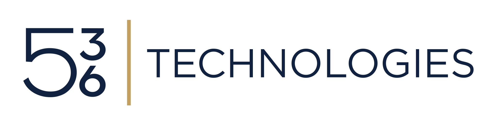

# 536 Technologies

## Make existing platforms easier to understand, change, and operate

Founder-led platform engineering for the systems that already run the business.

## Platform change should be reviewable

Existing platforms often accumulate configuration across admin consoles,
scripts, tickets, spreadsheets, repositories, and people's heads. We work
inside the live environment and help teams turn fragmented change into a
dependable delivery path they can own.

## How we work

- **Map:** Understand the live platform, ownership, risks, and recurring
  bottlenecks.
- **Codify:** Put the right infrastructure, configuration, access models, and
  policy under version control.
- **Operationalize:** Establish testing, delivery, recovery, observability,
  documentation, and runbooks.
- **Enable:** Create clear ownership, paved paths, templates, standards, and
  knowledge transfer.

Clients can engage 536 Technologies for one phase, several phases, or the
complete path.

## Where we work

We apply this method across cloud, data, identity, endpoint, AI infrastructure,
and automation and delivery systems. Our current public work is deepest around
Azure, Databricks, Terraform, Microsoft identity and endpoint systems, CI/CD,
cloud migration, and platform automation.

## Open source

- [Terraform Provider for Daytona](https://github.com/536tech/terraform-provider-daytona)
- [Terraform Provider for E2B](https://github.com/536tech/terraform-provider-e2b)

## Work with us

Jonathan Moss leads consulting delivery from mapping through implementation
and handoff.

[536tech.com](https://536tech.com) · [hello@536tech.com](mailto:hello@536tech.com)
